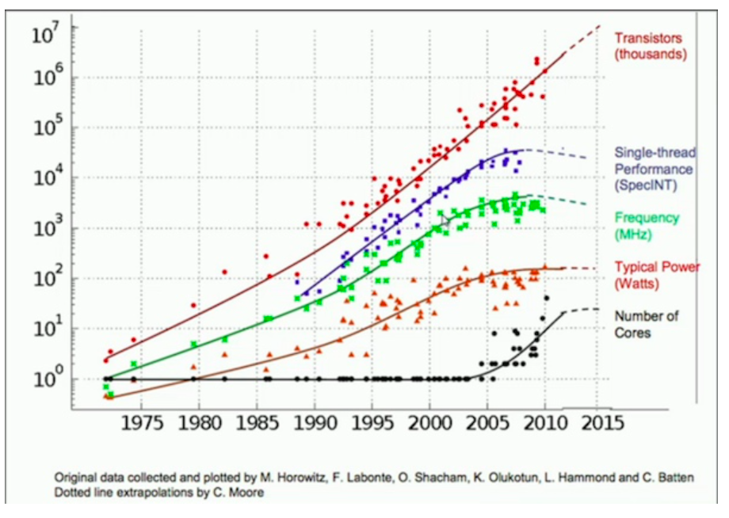
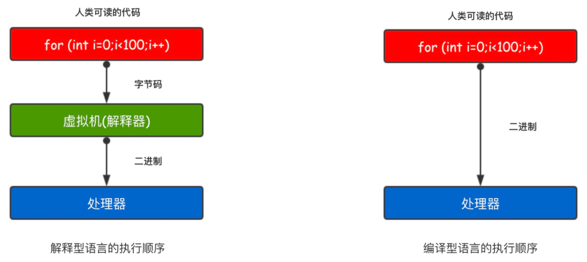
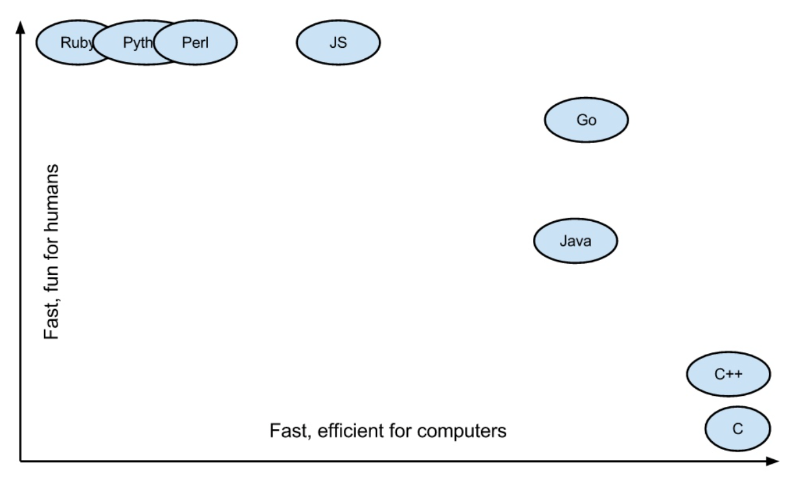

# Why GoLang?

Go语言 —— 让你用写Python代码的开发效率编写C语言代码。

## 为什么互联网世界需要 Go 语言

### 硬件限制：摩尔定律已然失效

> 摩尔定律：当价格不变时，集成电路上可容纳的元器件的数目，约每隔18-24个月便会增加一倍，性能也将提升一倍。换言之，每一美元所能买到的电脑性能，将每隔18-24个月翻一倍以上。

从上面的图表可以看出，近十年单线程性能和处理器频率保持稳定。我们不能像之前一样把添加更多晶体管当成是解决方案，因为在较小规模上一些量子特性开始出现（如隧道效应），并且因为在同样小的空间里放置更多晶体管的代价非常昂贵，每1美元可以添加的晶体管数量开始下降。

制造商开始从其他方面提高处理器的性能：

1. 向处理器添加越来越多的内核，如四核和八核CPU。
2. 发明了超线程技术。
3. 为处理器添加了更多缓存以提高性能。

但上述解决方案也有其自身的局限性。因为成本原因我们不能无限制的为计算机添加内核，也无法无限制的添加缓存来提高性能，因为缓存越大，取值的性能越低。

我们没有办法在硬件上一直取得突破，我们需要提高软件的性能或者说我们需要高性能的软件。

### Go语言为并发而生

如上所述，硬件制造商正在为处理器添加越来越多的内核以提高性能。所有数据中心都在这些处理器上运行，更重要的是，今天的应用程序使用多个微服务来维护数据库连接，消息队列和维护缓存。因此，开发的软件和编程语言应该可以轻松地支持并发性，并且应该能够随着CPU核心数量的增加而可扩展。

但是，大多数现代编程语言（如Java，Python等）都来自90年代的单线程环境。虽然一些编程语言的框架在不断地提高多核资源使用效率，例如 Java 的 Netty 等，但仍然需要开发人员花费大量的时间和精力搞懂这些框架的运行原理后才能熟练掌握。

Go于2009年发布，当时多核处理器已经上市。Go语言在多核并发上拥有原生的设计优势，Go语言从底层原生支持并发，无须第三方库、开发者的编程技巧和开发经验。

很多公司，特别是中国的互联网公司，即将或者已经完成了使用 Go 语言改造旧系统的过程。经过 Go 语言重构的系统能使用更少的硬件资源获得更高的并发和I/O吞吐表现。充分挖掘硬件设备的潜力也满足当前精细化运营的市场大环境。

Go语言的并发是基于`goroutine`的，`goroutine`类似于线程，但并非线程。可以将`goroutine`理解为一种虚拟线程。Go 语言运行时会参与调度`goroutine`，并将`goroutine`合理地分配到每个 CPU 中，最大限度地使用CPU性能。开启一个`goroutine`的消耗非常小（大约2KB的内存），你可以轻松创建数百万个`goroutine`。

`goroutine`的特点：

1. `goroutine`具有可增长的分段堆栈。这意味着它们只在需要时才会使用更多内存。
2. `goroutine`的启动时间比线程快。
3. `goroutine`原生支持利用channel安全地进行通信。
4. `goroutine`共享数据结构时无需使用互斥锁。

### Go性能强悍

与其他现代高级语言（如Java/Python）相比，使用C，C++的最大好处是它们的性能。因为C/ C++是编译型语言而不是解释的语言。 处理器只能理解二进制文件，Java和Python这种高级语言在运行的时候需要先将人类可读的代码翻译成字节码，然后由专门的解释器再转变成处理器可以理解的二进制文件。

同C,C++一样，Go语言也是编译型的语言，它直接将人类可读的代码编译成了处理器可以直接运行的二进制文件，执行效率更高，性能更好。

数据来源：[https://benchmarksgame-team.pages.debian.net/benchmarksgame/](https://benchmarksgame-team.pages.debian.net/benchmarksgame/)

可以看出，Go 语言在性能上更接近于 Java 语言，虽然在某些测试用例上不如经过多年优化的 Java 语言，但毕竟 Java 语言已经经历了多年的积累和优化。Go 语言在未来的版本中会通过不断的版本优化提高单核运行性能。

### Go语言简单易学

#### 语法简洁

Go 语言简单易学，学习曲线平缓，不需要像 C/C++ 语言动辄需要两到三年的学习期。Go 语言被称为“互联网时代的C语言”。Go 语言的风格类似于C语言。其语法在C语言的基础上进行了大幅的简化，去掉了不需要的表达式括号，循环也只有 for 一种表示方法，就可以实现数值、键值等各种遍历。

#### 代码风格统一

Go 语言提供了一套格式化工具 —— `go fmt`。一些 Go 语言的开发环境或者编辑器在保存时，都会使用格式化工具进行修改代码的格式化，这样就保证了不同开发者提交的代码都是统一的格式。

#### 开发效率高

Go语言实现了开发效率与执行效率的完美结合，让你像写Python代码（效率）一样编写C代码（性能）。

## 学习Go语言的前景

目前Go语言已经⼴泛应用于人工智能、云计算开发、容器虚拟化、⼤数据开发、数据分析及科学计算、运维开发、爬虫开发、游戏开发等领域。

Go语言简单易学，天生支持并发，完美契合当下高并发的互联网生态。

国内Go语言的需求潜力巨大，目前无论是国内大厂还是新兴互联网公司基本上都会有Go语言的岗位需求。

抓住趋势，要学会做一个领跑者而不是跟随者。

下图是应用Go语言的公司举例：

除了上面列出的大厂外，很多小型公司或创业公司也开始使用Go语言，并且很多公司把Go语言作为其主要开发语言。

现在就开始我们的Go语言学习之旅吧！

Life is too short, let’s Go.
